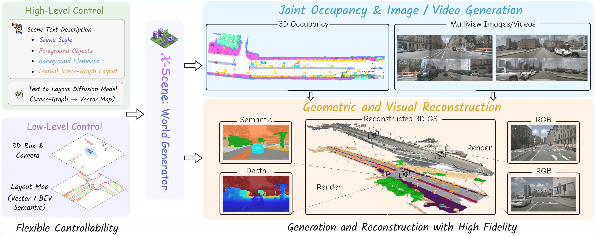
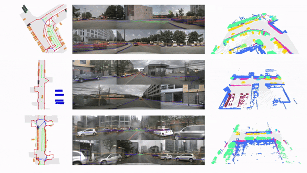

#  𝒳-Scene: Large-Scale Driving Scene Generation with High Fidelity and Flexible Controllability

[](https://arxiv.org/abs/2506.13558) [](https://x-scene.github.io) 


> Yu Yang<sup>1,2</sup>, Alan Liang<sup>2</sup>, Jianbiao Mei<sup>1</sup>, Yukai Ma<sup>1</sup>, Yong Liu<sup>1</sup>, Gim Hee Lee<sup>2</sup> <br>
> <sup>1</sup> Zhejiang University <sup>2</sup> National University of Singapore <br>


## 📢 News
- `[2025-09-19]` Our 𝒳-Scene is accepted by NeurIPS 2025!

- `[2025-06-18]` We released our project website [here](https://x-scene.github.io/).

- `[2025-06-16]` The paper can be accessed at [arxiv](https://arxiv.org/abs/2506.13558).


## 🎯 Abstract
<div style="text-align:center;">
  
</div>

**Overview of 𝒳-Scene**. a unified **world generator** that supports *multi-granular controllability* through high-level text-to-layout generation and low-level BEV layout conditioning. It performs *joint occupancy, image, and video generation* for 3D scene synthesis and reconstruction with high fidelity.


## 📝 Getting Started
Please refer to the following documents to set up the environment and run 𝒳-Scene:
-  🛠️ [Installation Guide](DOCS/INSTALL.MD)
- 📊 [Dataset Preparation](DOCS/DATASET.MD)
- ⚡ [Train and Evaluation](DOCS/TRAINTEST.MD)


## 🎯 Roadmap
- [x] Paper & Project Page
- [x] Release the Training Code
- [x] Release the Inference Code
- [x] Release the Processed Data


## 🎥 Demo of Layout-to-Scene Generation
<div style="text-align:center;">
    
</div>

<div style="text-align:center;">
    
</div>

## 🤝 Acknowledgments

We are grateful for the following open-source projects that inspired or assisted the development of 𝒳-Scene:

| Occupancy Generation | Video & Driving Synthesis |
| :--- | :--- |
| [SemCity](https://github.com/zoomin-lee/SemCity) | [MagicDrive](https://github.com/cure-lab/MagicDrive) |
| [DynamicCity](https://github.com/3DTopia/DynamicCity) | [DriveArena](https://github.com/PJLab-ADG/DriveArena) |
| [OccSora](https://github.com/wzzheng/OccSora) | [LiDARCrafter](https://github.com/worldbench/LiDARCrafter) |
| [UniScene](https://github.com/Arlo0o/UniScene-Unified-Occupancy-centric-Driving-Scene-Generation) | [X-Drive](https://github.com/yichen928/X-Drive) |

*Special thanks to these communities for their incredible contributions to the field!*


## 🔖 Citation

```bibtex
@article{yang2025xscene,
  title={X-Scene: Large-Scale Driving Scene Generation with High Fidelity and Flexible Controllability},
  author={Yang, Yu and Liang, Alan and Mei, Jianbiao and Ma, Yukai and Liu, Yong and Lee, Gim Hee},
  journal={arXiv preprint arXiv:2506.13558},
  year={2025}
}